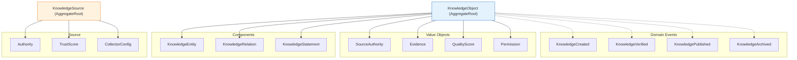

# Domain Diagram — Revision 1

```mermaid
graph TD
    KO["KnowledgeObject (AggregateRoot)"]
    KSRC["KnowledgeSource (AggregateRoot)"]

    subgraph Components["Components"]
        KE["KnowledgeEntity"]
        KR["KnowledgeRelation"]
        KS["KnowledgeStatement"]
    end

    subgraph Values["Value Objects"]
        SA["SourceAuthority"]
        EV["Evidence"]
        QS["QualityScore"]
        PM["Permission"]
    end

    subgraph SRC["Source"]
        AU["Authority"]
        TS["TrustScore"]
        CC["CollectorConfig"]
    end

    subgraph Events["Domain Events"]
        KC["KnowledgeCreated"]
        KV["KnowledgeVerified"]
        KP["KnowledgePublished"]
        KA["KnowledgeArchived"]
    end

    KO --> SA
    KO --> KE
    KO --> KR
    KO --> KS
    KO --> EV
    KO --> QS
    KO --> PM
    KO -.-> KC
    KO -.-> KV
    KO -.-> KP
    KO -.-> KA

    KSRC --> AU
    KSRC --> TS
    KSRC --> CC

    style KO fill:#e3f2fd,stroke:#1565c0
    style KSRC fill:#fff3e0,stroke:#ef6c00
```
